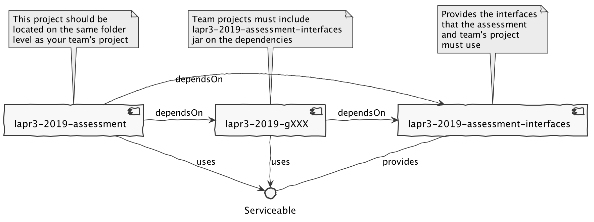
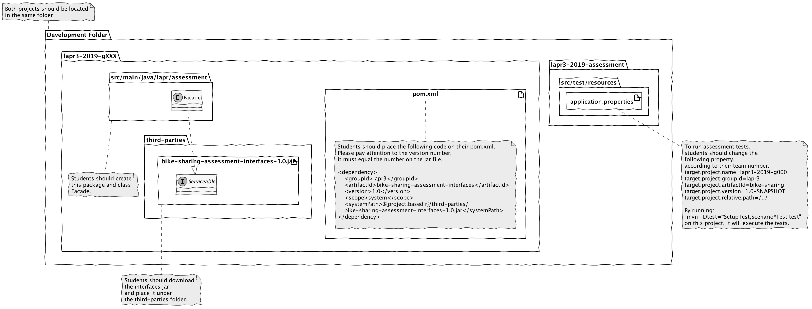

# README #

This is a test project to assess your project.

To run this project execute: 

```
$ mvn -Dtest=*SetupTest,Scenario*Test test
```

## Dependencies ##

This project must be located at the same level as your lapr project.

The following properties should be set on file test/java/resources/application.properties:

```
project.name=lapr3-2019-g000
project.groupId=lapr3
project.artifactId=ride-sharing
project.version=1.0-SNAPSHOT
project.relative.path=/../
```

You should change the project.name property to lapr3-2019-g<team-id>, where <team-id> should be replaced by your team id (e.g. team #1 => lapr3-2019-g001)  

## How to setup tests ##

There is a ProjectSetupTest class so that this application can use the classes from the target jar.

For each Test Scenario, create a package named lapr.project.assessment.scenarioXXX, where XXX is replaced by the scenario id.

On this package, create a Test Class named ScenarioXXXTest, where XXX should be replaced by the scenario id.

For resources, creata a folder named test/resources/scenario001 and place the expected-results.csv and input.csv.

After running the tests, the output will be placed in this directory.



