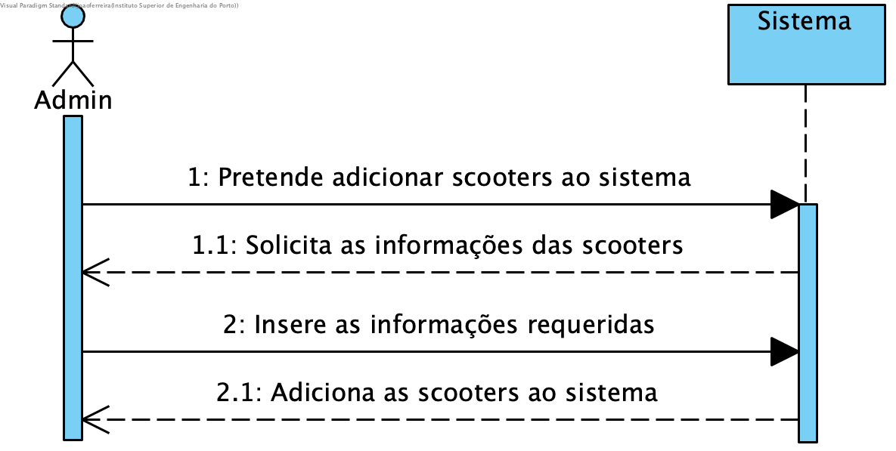
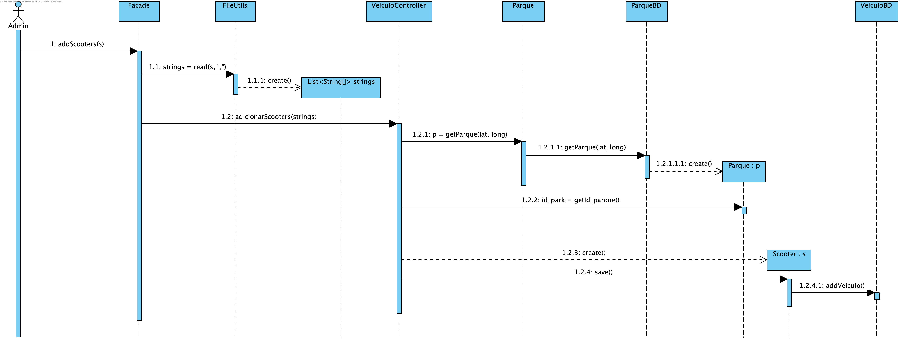

# **UC01 Adicionar scooters

JIRA Issue: https://jira.dei.isep.ipp.pt:8443/browse/G45-38

## Analysis

### Descrição breve

O utilizador pretende adicionar scooters à base de dados. O sistema solicita as informações necessárias relativa à scooter. O utilizador fornece as informações necessárias. O sistema adiciona a informação relativa à scooter à base de dados.

*Ator Principal*

Administrador

### System Sequence Diagram (SSD)

## Design

### Sequence Diagram

### Class Diagram (CD)

