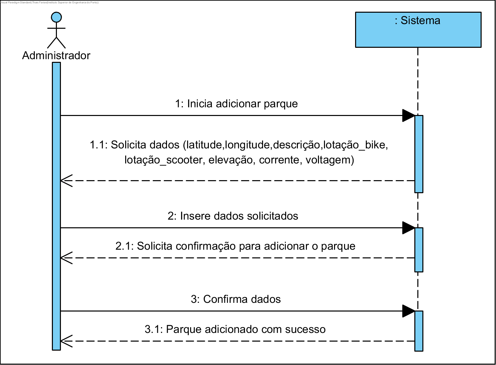
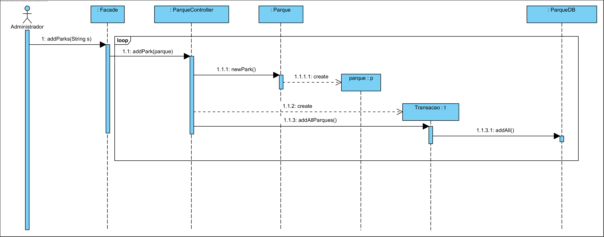
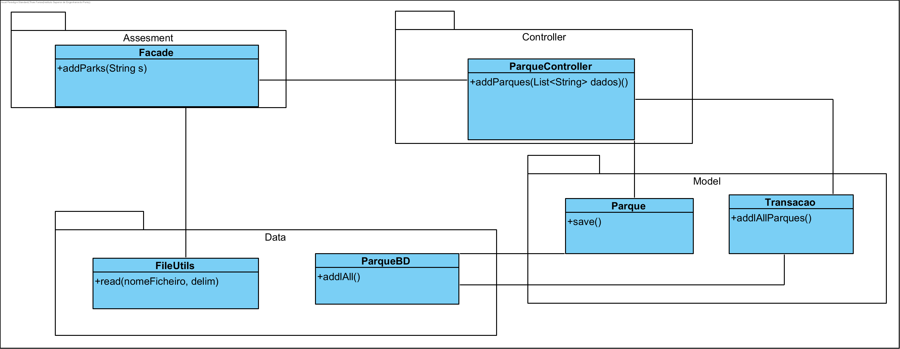

# **UC03 Adicionar Parques

JIRA Issue: https://jira.dei.isep.ipp.pt:8443/browse/G45-41

## Análise

### Descrição breve

O administrador quer adicionar um parque. O sistema solicita os dados necessários.
O administrador insere os dados necessários. O sistema solicita confirmação dos dados inseridos.
O administrador confirma os dados. O parque é adicionado ao sistema.

*Ator Principal*

Administrador

### System Sequence Diagram (SSD)

## Design

### Diagrama de Sequência

### Diagrama de Classes (CD)

