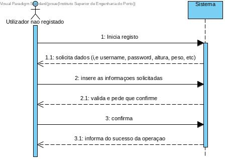
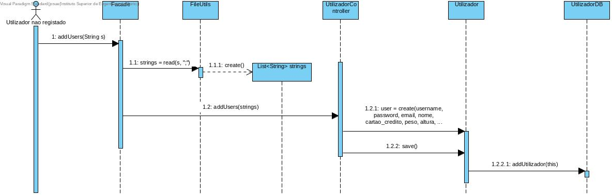
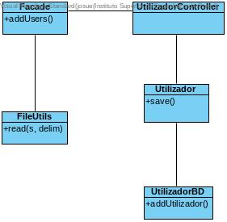

# **UC04 Registar Utilizadors

JIRA Issue: https://jira.dei.isep.ipp.pt:8443/browse/G45-46

## Analysis

### Descrição breve

O utilizador não registado pretende registar na aplicação. O sistema solicita as informações necessárias (i.e username, password, peso, altura, etc), O utilizador preenche a informação pedida. O sistema valida e pede confirmação. O utilizador confirma. O sistema informa do sucesso da operação.

*Ator Principal*

Utilizador não registado

### System Sequence Diagram (SSD)

## Design

### Sequence Diagram

### Class Diagram (CD)

