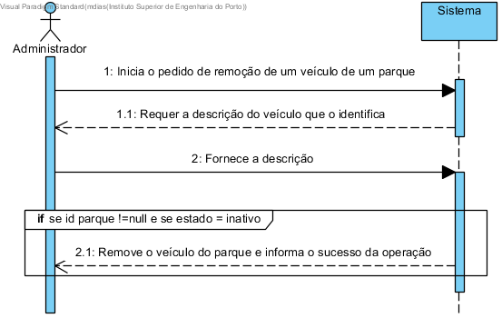
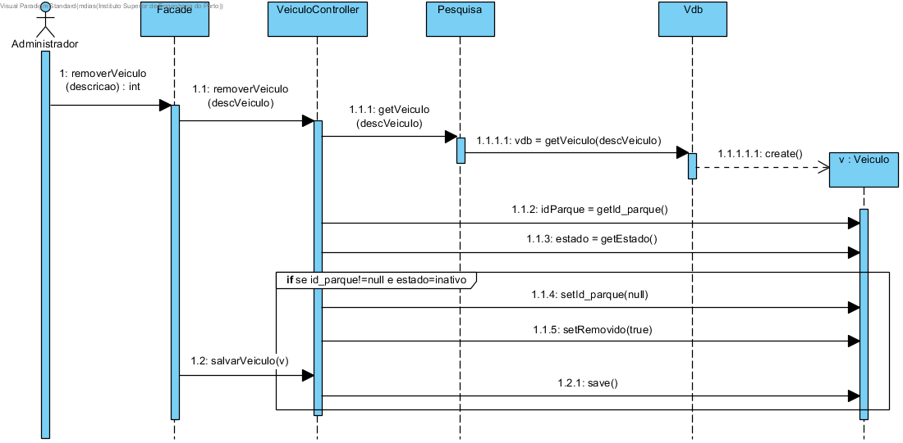
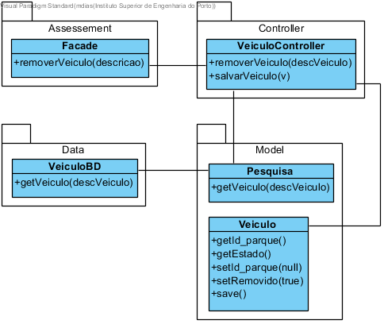

# UC05 Remover Veiculo

JIRA Issue: https://jira.dei.isep.ipp.pt:8443/browse/G45-39

## Análise

### Descrição breve

O administrador requer a remoção de um veículo. O
sistema requer a identificação do veículo. O administrador fornece a
identificação do veiculo. O sistema verifica se o id do parque relativo ao veículo não é nulo e se o veículo não está em uso.
Neste caso, remove o veículo e informa o administrador.

*Ator Principal*

Administrador

### Short Sequence Diagram (SSD)



## Design

### Sequence Diagram (SD)



### Class Diagram (CD)





