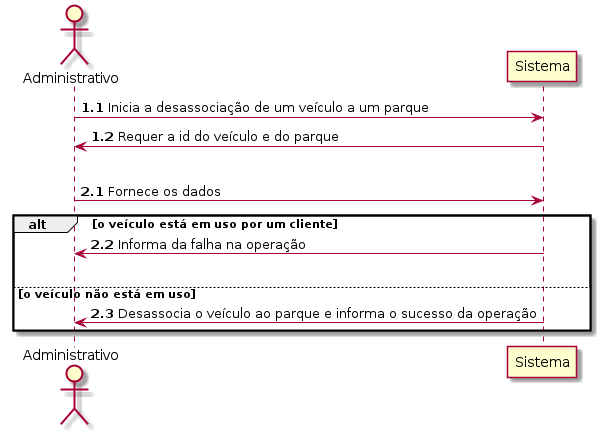
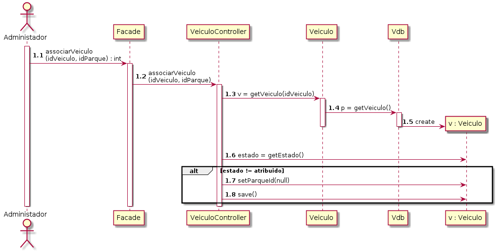
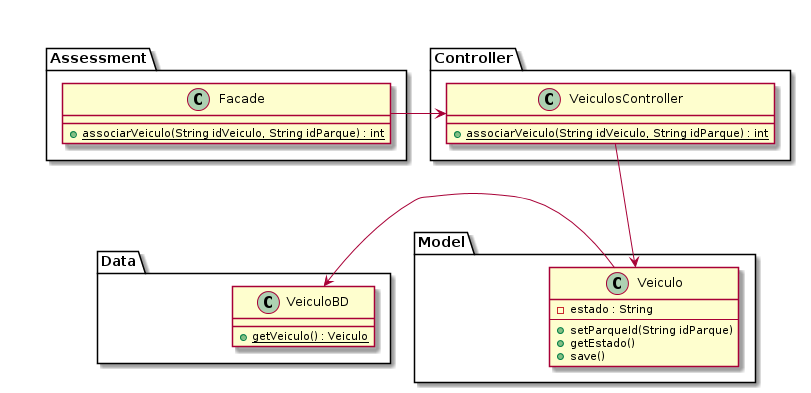

# UC07 Desassociar Veiculo a Parque

JIRA Issue: https://jira.dei.isep.ipp.pt:8443/browse/G45-45

## Analysis

### Descrição breve

O administrativo requer a desassociação de um veículo à um parque. O
sistema requer a identificação do veículo. O administrativo fornece a
identificação do parque. O sistema verifica se o veículo está em uso.
Neste caso, informa ao administrativo e cancela a operação. Se o
veículo não estiver em uso, desassocia o veículo ao parque.

*Ator Principal*

Administrativo

### System Sequence Diagram (SSD)

## Design

### Sequence Diagram

### Class Diagram (CD)

