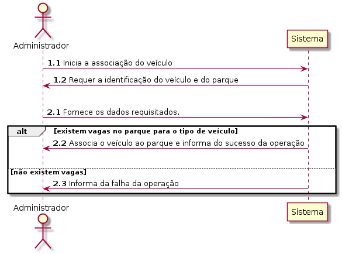
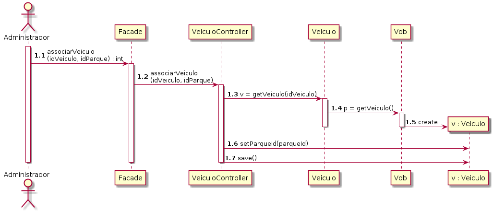
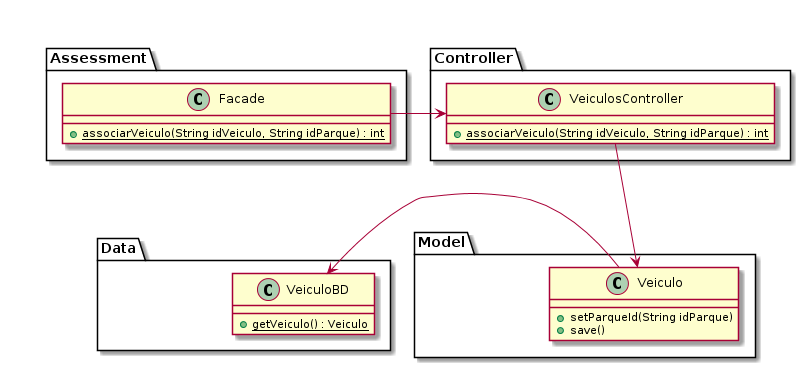

# UC08 Associar Veiculo a Parque

JIRA Issue: https://jira.dei.isep.ipp.pt:8443/browse/G45-44

## Analysis

### Descrição breve

O administrativo inicia a associação de um veículo a um parque. O
sistema requer o veículo a identificação do veículo e do parque ao
qual deve associar o veículo. O administrativo fornece os dados. O
sistema verifica se o parque possui vagas livres para depositar o
veículo, de acordo com seu tipo. Se houverem vagas, o sistema associa
o veículo ao parque. De outra forma, o caso de uso termina.

*Ator Principal*

Administrativo

### System Sequence Diagram (SSD)

## Design

### Sequence Diagram

### Class Diagram (CD)

