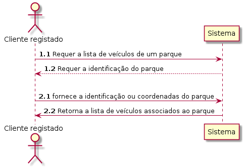
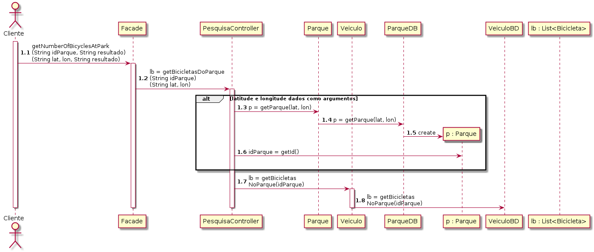
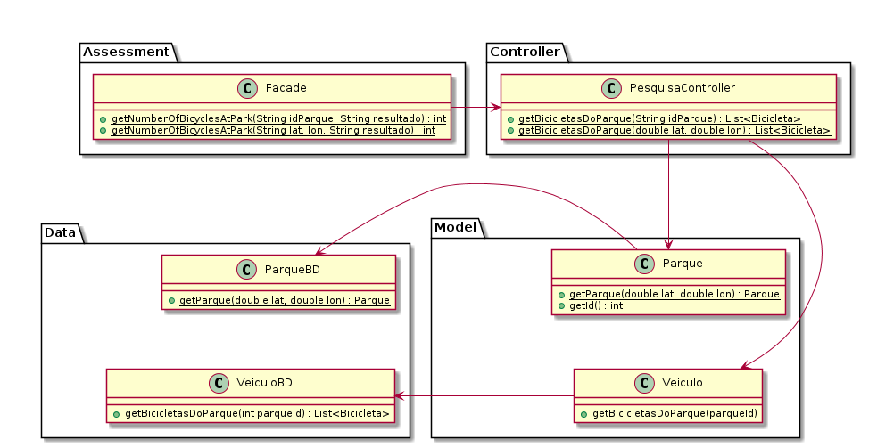

# UC09 Listar Veiculos disponíveis em Parque

JIRA Issue: https://jira.dei.isep.ipp.pt:8443/browse/G45-49

## Analysis

### Descrição breve

O utilizador requer a lista de veículos disponíveis em um parque. O
sistema solicita o a identificação ou coordenadas de um parque. O
utilizador fornece a identificação do parque. O sistema verifica a
todos os veículos associados à esse parque e os retorna como uma
lista.

*Ator Principal*

Cliente registado

### System Sequence Diagram (SSD)

## Design

### Sequence Diagram

### Class Diagram (CD)

