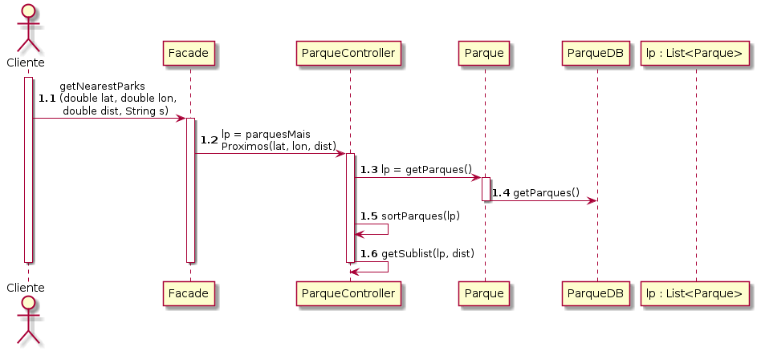

# UC10 Listar Parques  Mais próximos 

JIRA Issue: https://jira.dei.isep.ipp.pt:8443/browse/G45-48

## Analysis

### Descrição breve

O utilizador requer a lista de parques mais próximos. O sistema
verifica a posição do utilizador pelas suas coordenadas e verifica
quais parques se encontram dentro do raio de 1km do utilizador. Estes
parques são ordenados por distância em ordem ascendente e retornados
ao utilizador.

*Ator Principal*

Cliente registado

### System Sequence Diagram (SSD)

## Design

### Sequence Diagram

### Class Diagram (CD)

