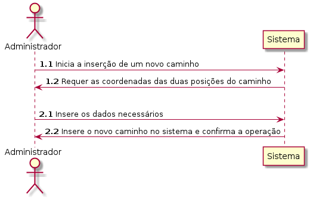
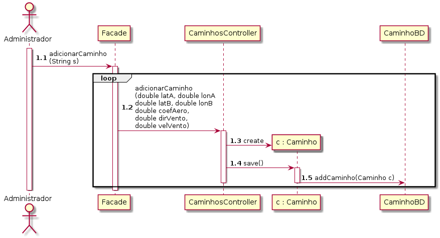
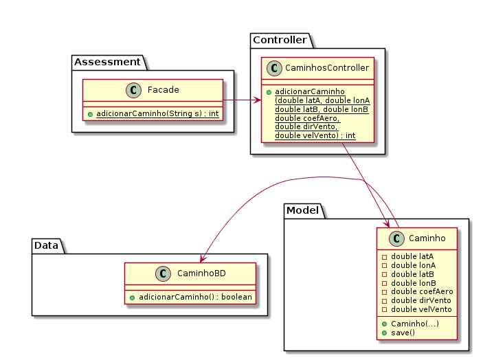

# UC11 Adicionar Caminho

JIRA Issue: https://jira.dei.isep.ipp.pt:8443/browse/G45-126

## Analysis

### Descrição breve

O administrador inicia a inserção de um caminho. O sistema solicita as
coordenadas da posição incial e final. O administrador fornece os
dados. O sistema adiciona o novo caminho no sistema.

*Ator Principal*

Administrador

### System Sequence Diagram (SSD)

## Design

### Sequence Diagram

### Class Diagram (CD)

