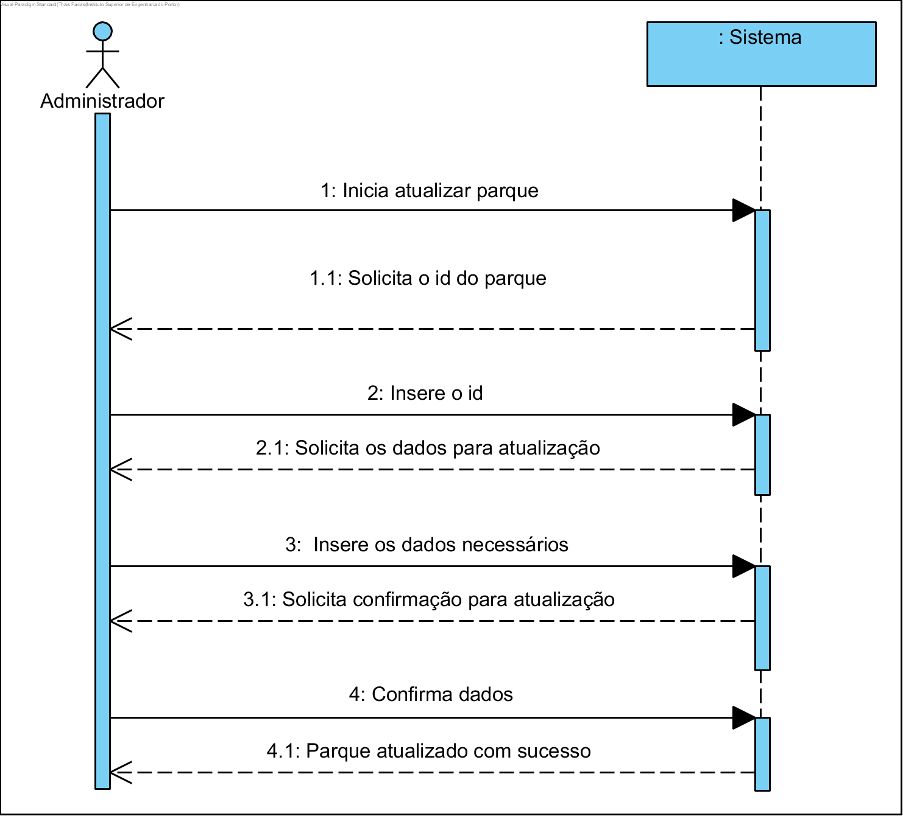
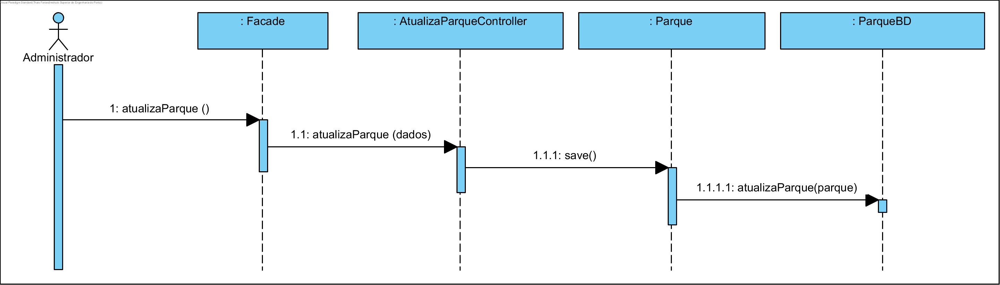
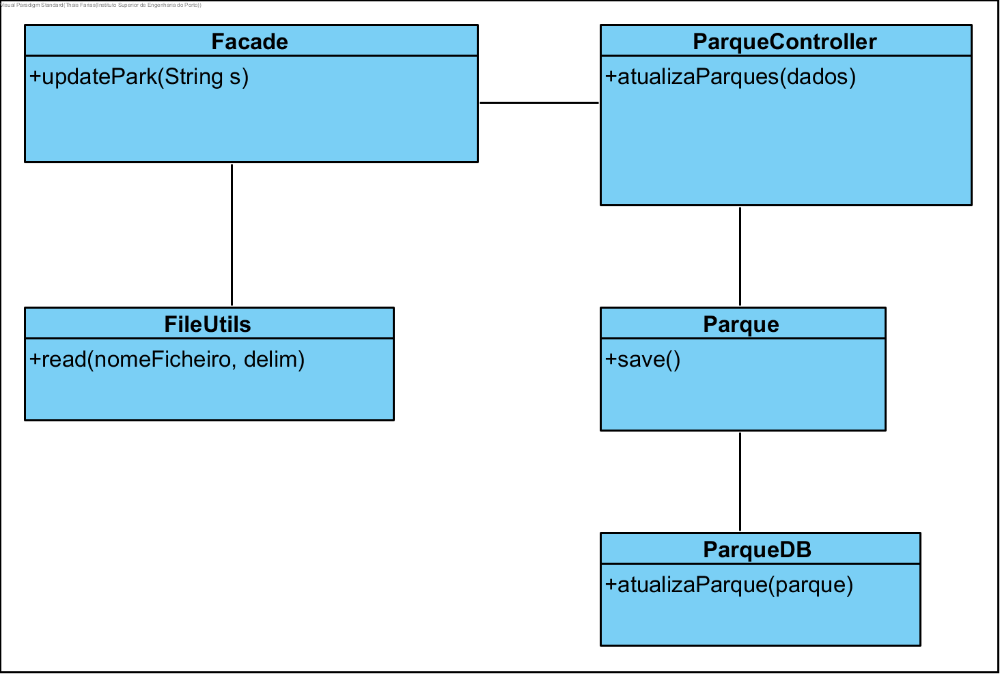

# **UC13 Atualizar parque

JIRA Issue: https://jira.dei.isep.ipp.pt:8443/browse/G45-43

## Análise

### Descrição breve

O administrador inicia atualização de um parque. O sistema solicita o id do parque. O administrador insere o id. O sistema solicita os dados para atualização.
O administrador insere os dados necessários. O sistema solicita confirmação dos dados inseridos.
O administrador confirma os dados. O parque é atualizado no sistema.

*Ator Principal*

Administrador

### System Sequence Diagram (SSD)

## Design

### Diagrama de Sequência

### Diagrama de Classes (CD)

