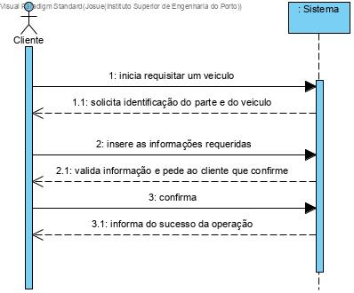
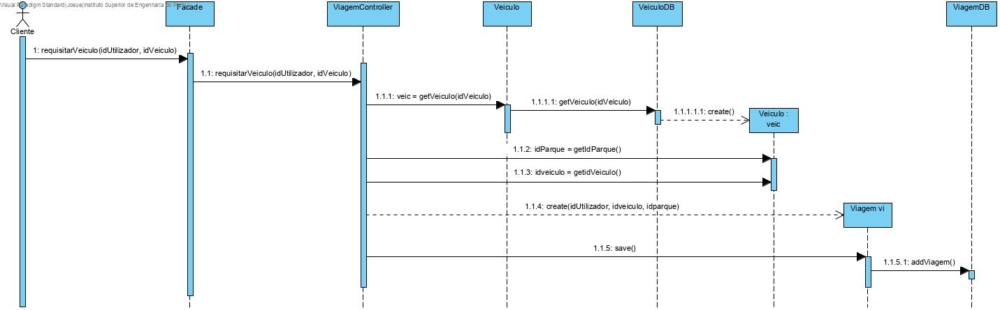
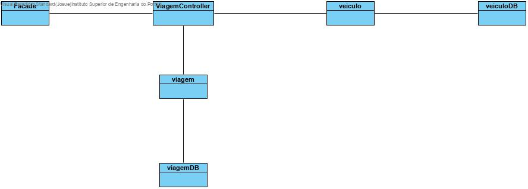

# UC14 Listar Parques  Mais próximos 

JIRA Issue: https://jira.dei.isep.ipp.pt:8443/browse/G45-48

## Analysis

### Descrição breve

O cliente registado inicia requisitar veiculo. O sistema
solicita a identificação do parque e do veiculo. 
O cliente insere as informações requeridas. O sistema valida a informação, 
verificando se o utilizador já se encontra com um veiculo e pede ao cliente que confirme.
O cliente confirma. O sistema informa do sucesso da operação.

*Ator Principal*

Cliente registado

### System Sequence Diagram (SSD)

## Design

### Sequence Diagram

### Class Diagram (CD)

