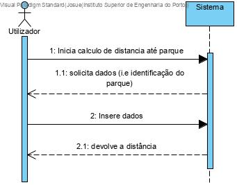
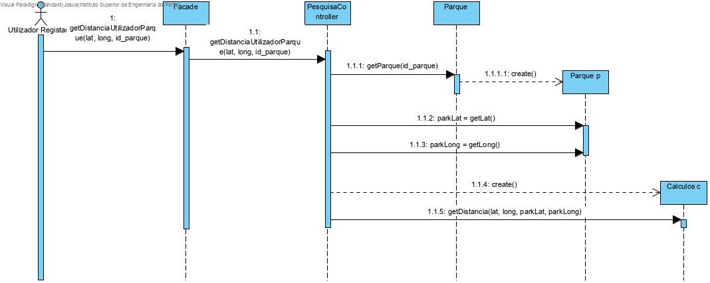
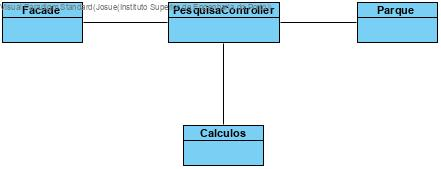

# **UC15 Calcular distancia do Utilizador até Parque

JIRA Issue: https://jira.dei.isep.ipp.pt:8443/browse/LPR19G45-47

## Análise

### Descrição breve

O utilizador pretende obter a distancia a que está de um parque. O sistema solicita a identificação do parque. O utilizador fornece as informações necessárias. O sistema devolve a distância do utilizador ao parque.

*Ator Principal*

utilizador Registado

### System Sequence Diagram (SSD)

## Design

### Sequence Diagram

### Class Diagram (CD)

