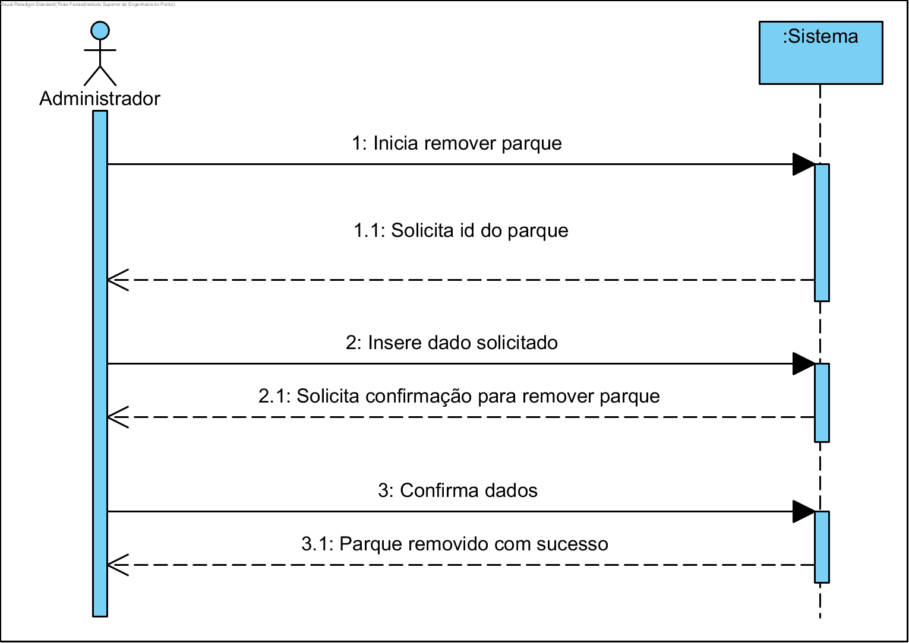
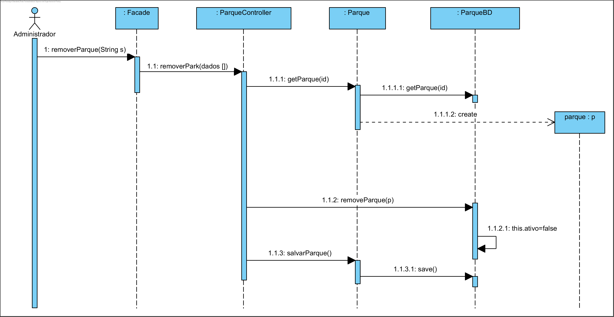
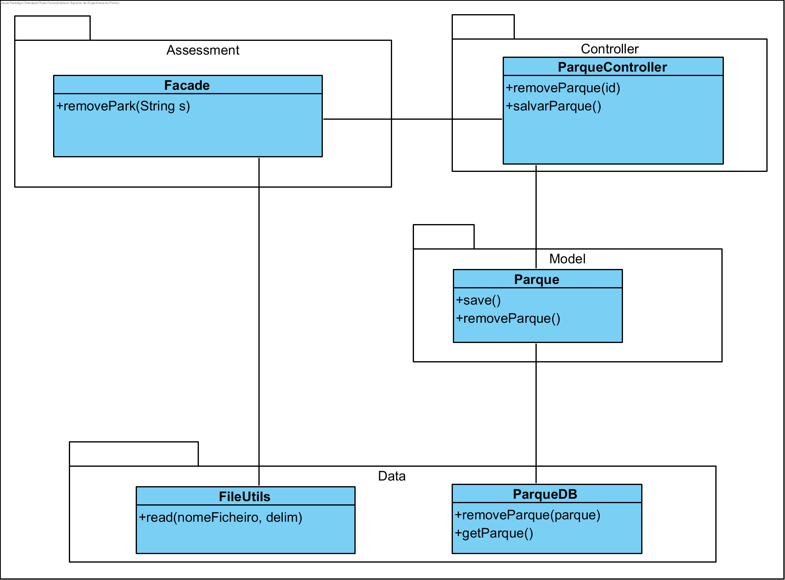

# UC17 Remover Parque

JIRA Issue: https://jira.dei.isep.ipp.pt:8443/browse/G45-42

## Análise

### Descrição breve

O administrador requer a remoção de um parque. O
sistema requer a identificação do parque. O administrador insere a identificação do parque. O sistema verifica e solicita a confirmação para remoção do parque. O administrador confirma. O parque é removido com sucesso.

*Ator Principal*

Administrador

### Short Sequence Diagram (SSD)



## Design

### Diagrama de Sequencia (SD)



### Diagrama de Classes (DC)




