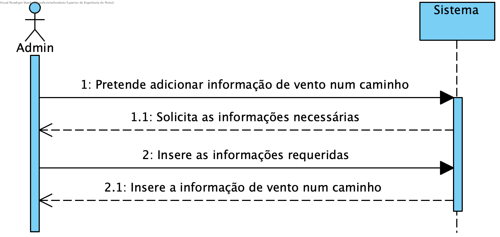
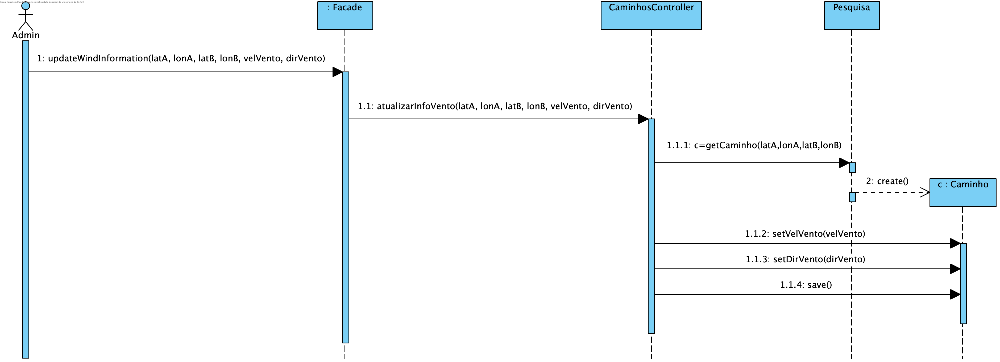
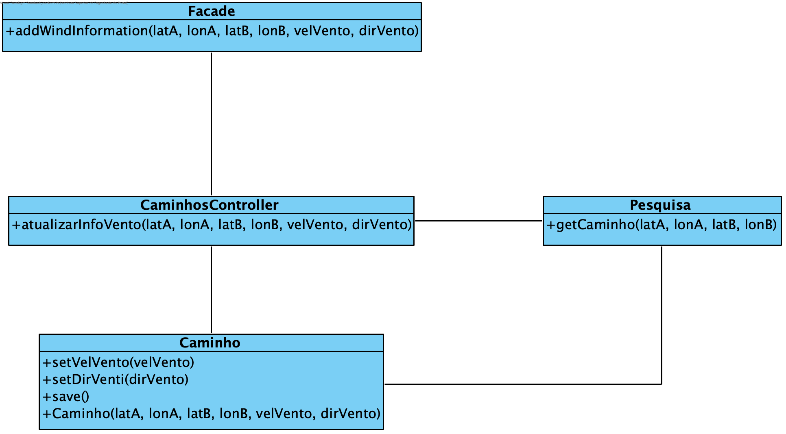

# UC17 Remover Parque

JIRA Issue: https://jira.dei.isep.ipp.pt:8443/browse/LPR19G45-166

## Análise

### Descrição breve

O Administrator inicia o processo de adicionar informação de vento num caminho. O sistema requere a informação necessária. O Administrator insere a informação necessária. O sistema adiciona a informação do vento a um caminho.

*Ator Principal*

Administrador

### Short Sequence Diagram (SSD)

## Design

### Diagrama de Sequencia (SD)

### Diagrama de Classes (DC)

