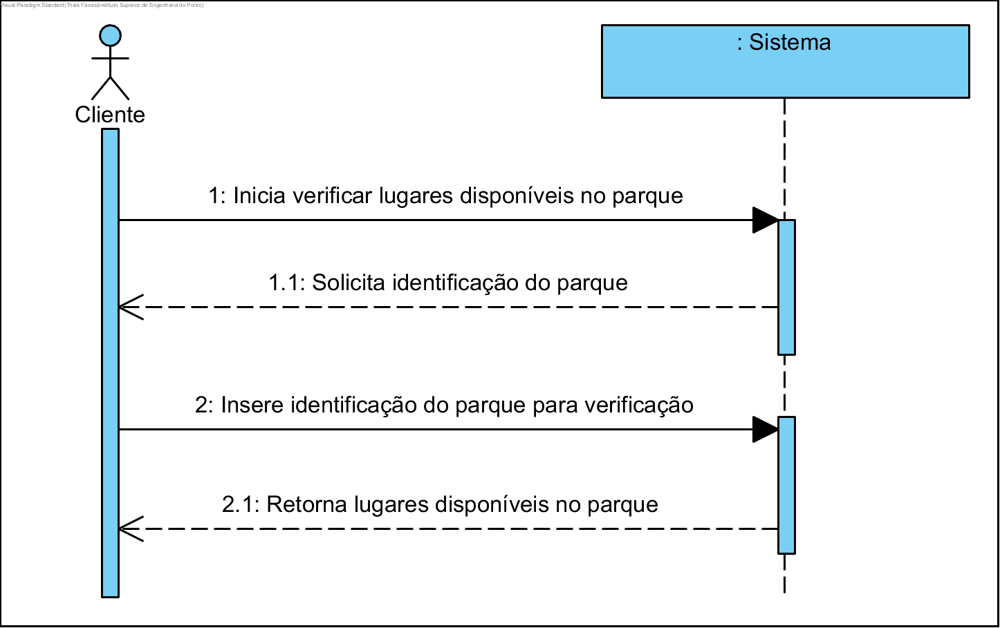
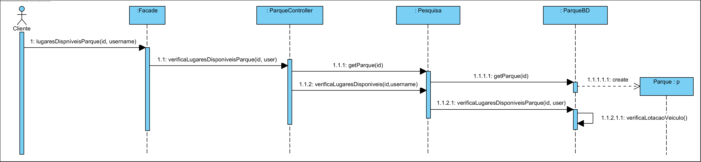

# UC19 Verifica Lugares Disponíveis no Parque

JIRA Issue: https://jira.dei.isep.ipp.pt:8443/browse/G45-50

## Análise

### Descrição breve

O Cliente quer verificar lugares disponíveis no parque. O sistema requer a identificação do parque. O Cliente insere a identificação do parque. O sistema verifica e devolve o número de lugares disponíveis no parque, de acordo com o tipo da bicicleta. 

*Ator Principal*

Cliente

### Short Sequence Diagram (SSD)



## Design

### Diagrama de Sequencia (SD)



### Diagrama de Classes (DC)




 


