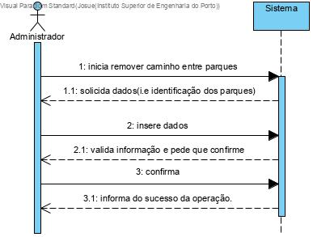
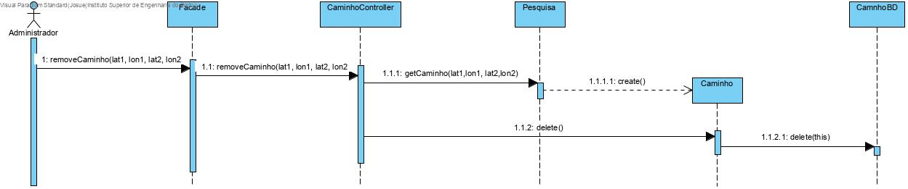
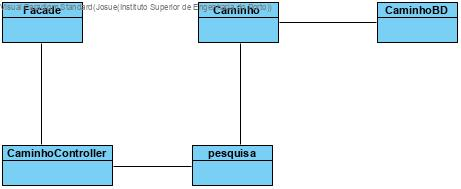

# UC20 Remover Caminho entre Parque

JIRA Issue: https://jira.dei.isep.ipp.pt:8443/browse/LPR19G45-127

## Análise

### Descrição breve

O Administrador quer remover caminho entre parques. O sistema requer a identificação dos parques. O administrador insere a identificação dos parques. O sistema valida a informação e solicita que confirme. O Administrador confirma. O sistema informa do sucesso da operação.

*Ator Principal*

Administrador

### Short Sequence Diagram (SSD)

## Design

### Diagrama de Sequencia (SD)

### Diagrama de Classes (DC)

