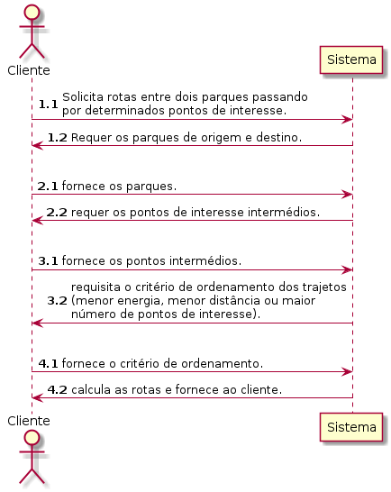
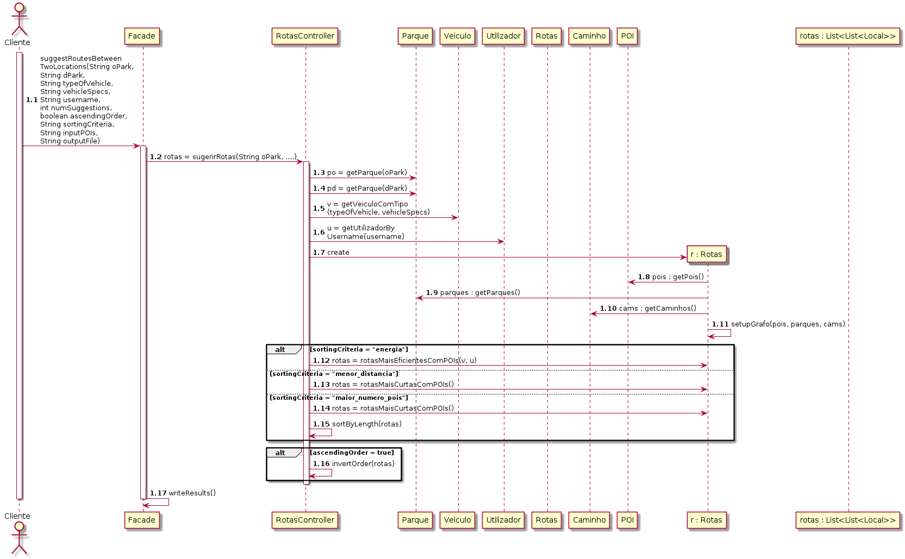
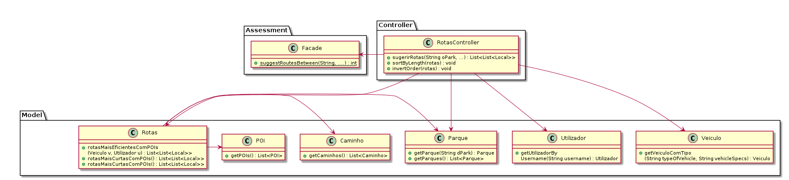

# UC21 

JIRA Issue: 148

## Análise

### Descrição breve

O cliente solicita rotas entre dois parques passando por
determinados pontos de interesse. O sistema requer os parques de
origem e destino. O cliente fornece os parques. O sistema requer
os pontos de interesse intermédios para o caminho. O cliente
fornece os pontos intermédios. O sistema requisita o critério de
ordenamento dos trajetos (menor energia, menor distância ou maior
número de pontos de interesse). O cliente fornece o critério de
ordenamento. O sistema calcula as rotas e fornece ao cliente.

*Ator Principal*

Cliente

### Short Sequence Diagram (SSD)

## Design

### Diagrama de Sequencia (SD)

### Diagrama de Classes (DC)

