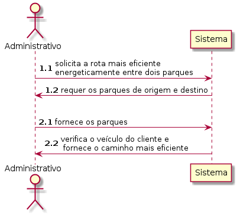
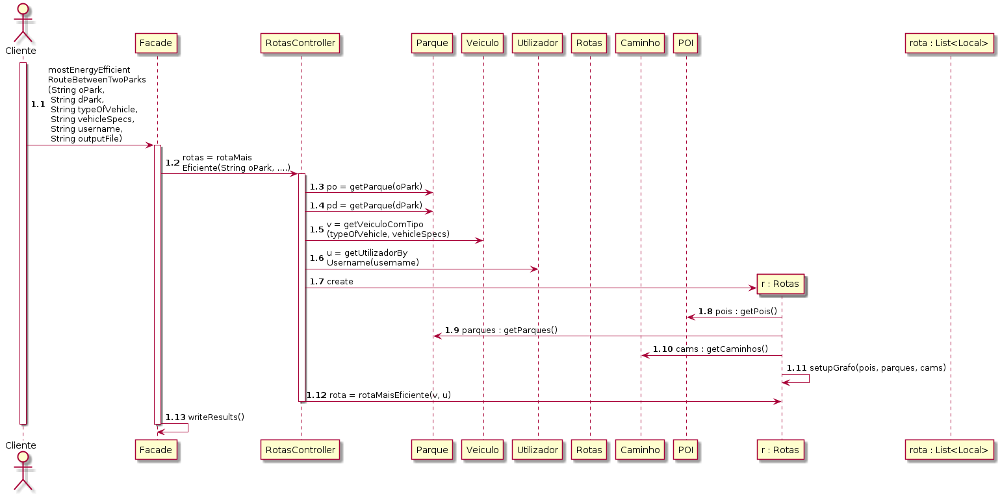
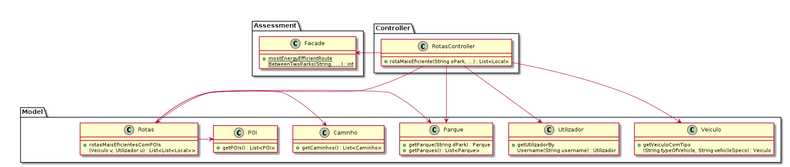

# UC22 

JIRA Issue:  153

## Análise

### Descrição breve

O cliente solicita a rota mais eficiente energeticamente entre
dois parques. O sistema requer os parques de origem e destino. O
cliente fornece os parques. O sistema verifica o veículo do
cliente e fornece o caminho mais eficiente.

*Ator Principal*

Cliente

### Short Sequence Diagram (SSD)

## Design

### Diagrama de Sequencia (SD)

### Diagrama de Classes (DC)

