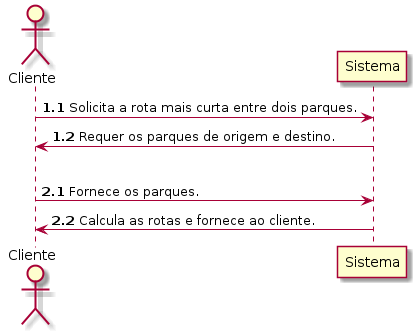
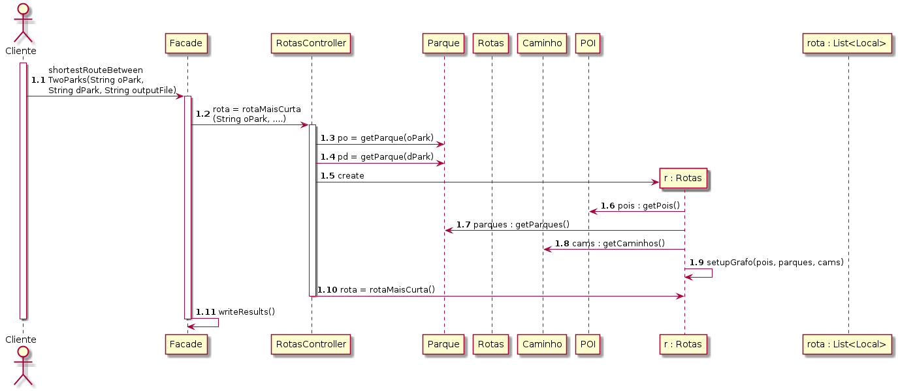
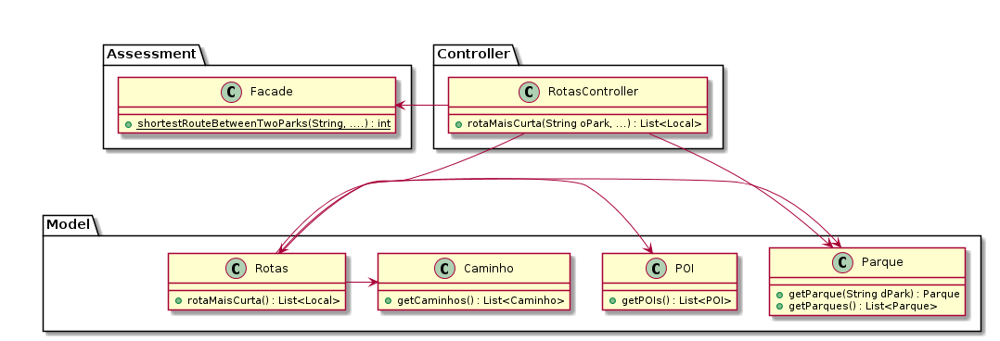

# UC23 

JIRA Issue: 171

## Análise

### Descrição breve

O cliente solicita a rota mais curta entre dois parques. O
sistema requer os parques de origem e destino. O cliente fornece
os parques. O sistema calcula as rotas e fornece ao cliente.

*Ator Principal*

Cliente

### Short Sequence Diagram (SSD)

## Design

### Diagrama de Sequencia (SD)

### Diagrama de Classes (DC)

