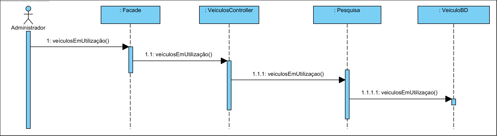

# UC24 Veículos em utilização

JIRA Issue: https://jira.dei.isep.ipp.pt:8443/browse/G45-165

## Análise

### Descrição breve

O Administrador requer um relatório de veículos em utilização. O sistema solicita os dados. O Administrador insere os dados solicitados. O sistema verifica e devolve o relatório de veículos em utilização do perído. 

*Ator Principal*

Administrador

### Short Sequence Diagram (SSD)



## Design

### Diagrama de Sequencia (SD)



### Diagrama de Classes (DC)




 


