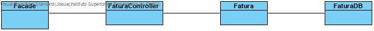

# UC25 Emitir Fatura

JIRA Issue: https://jira.dei.isep.ipp.pt:8443/browse/LPR19G45-147

## Análise

### Descrição breve

O Administrador inicia pedido de faturação. O sistema solicita os dados (ie informação do cliente e mês). O Administrador insere os dados solicitados. O sistema devolve a fatura. 

*Ator Principal*

Administrador

### Short Sequence Diagram (SSD)

## Design

### Diagrama de Sequencia (SD)

### Diagrama de Classes (DC)

 

