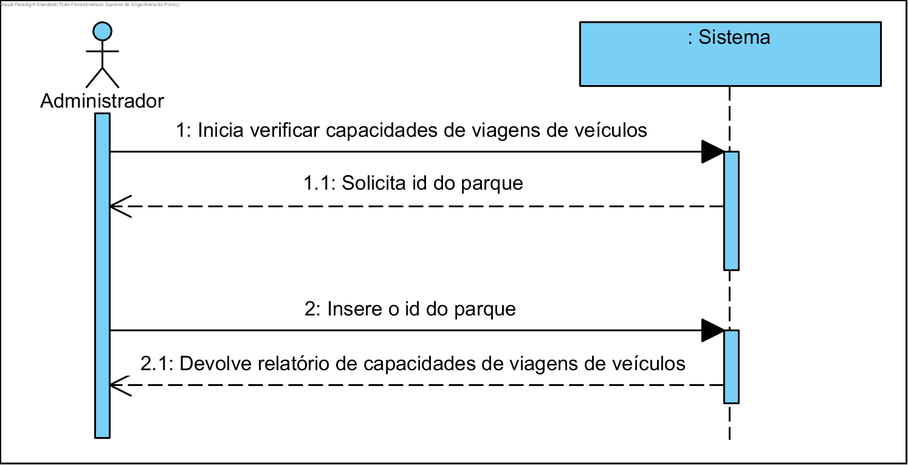
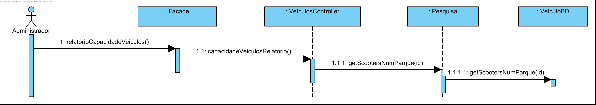

# UC19 Verifica Lugares Disponíveis no Parque

JIRA Issue: https://jira.dei.isep.ipp.pt:8443/browse/G45-164

## Análise

### Descrição breve

O Administrador quer verificar capacidade de viagem do veículo. O sistema requer a identificação do parque. O Administradir insere a identificação do parque. O sistema verifica e devolve o relatório de capacidades de viagens dos veículos

*Ator Principal*

Administrador

### Short Sequence Diagram (SSD)



## Design

### Diagrama de Sequencia (SD)



### Diagrama de Classes (DC)




 


