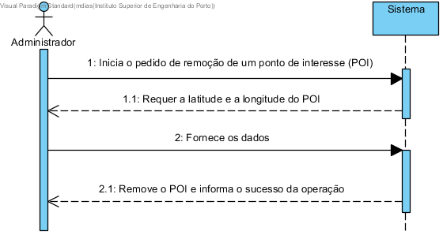
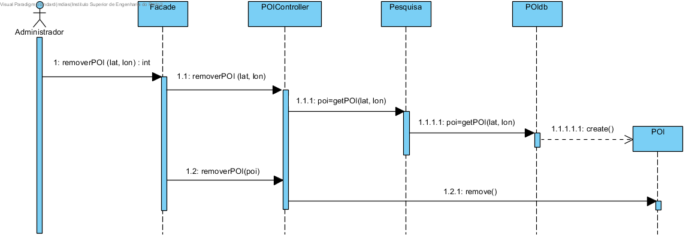
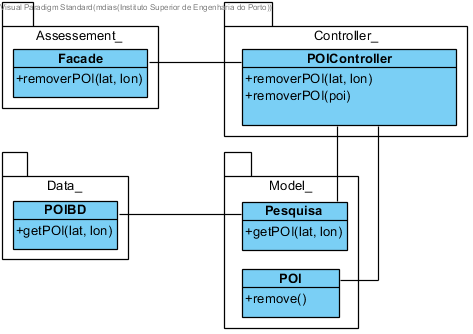

# UC27 Remover POI

JIRA Issue: https://jira.dei.isep.ipp.pt:8443/browse/G45-39

## Análise

### Descrição breve

O administrador requer a remoção de um ponto de interesse (POI). O
sistema requer a identificação do POI (latitude e longitude)). O administrador fornece a
identificação do POI. O sistema remove o POI e informa do sucesso da operação.

*Ator Principal*

Administrador

### Short Sequence Diagram (SSD)

## Design

### Sequence Diagram (SD)

### Class Diagram (CD)

