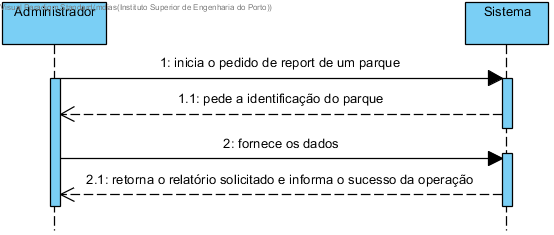
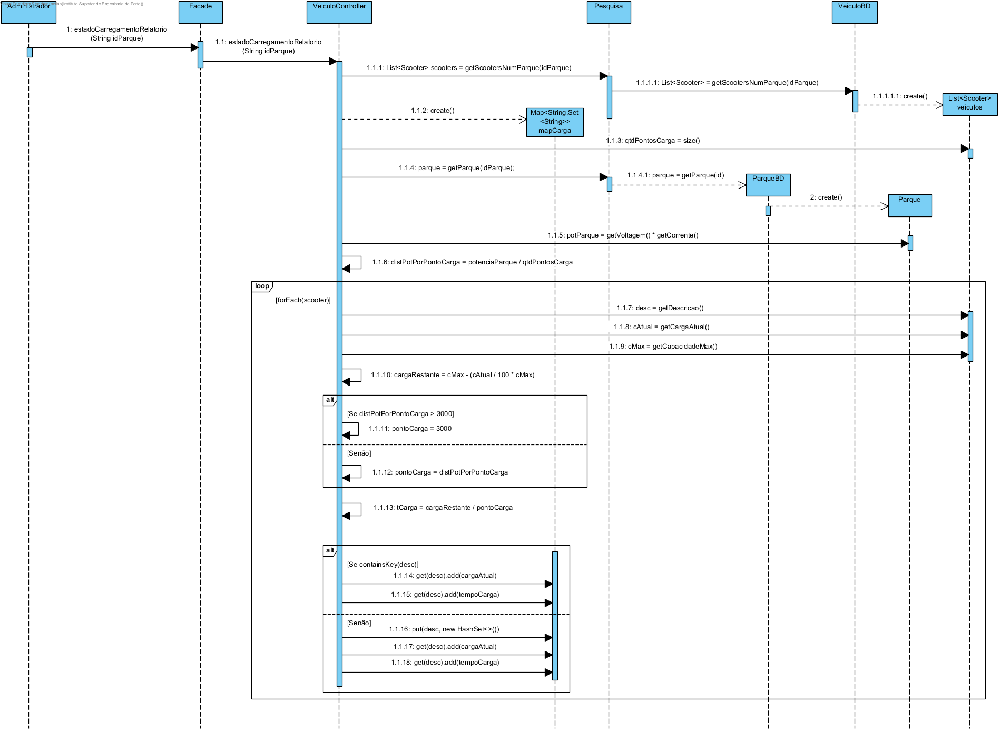
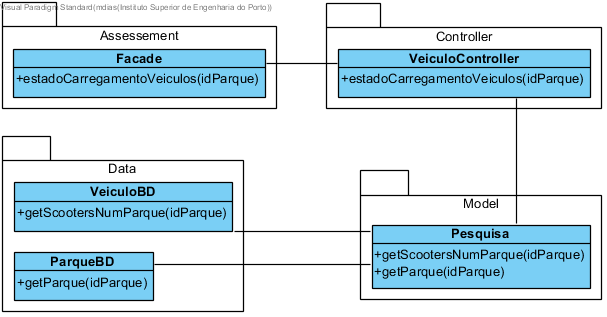

# UC29 Estado de carregamento dos veículos

JIRA Issue: https://jira.dei.isep.ipp.pt:8443/browse/G45-39

## Análise

### Descrição breve

O administrador requer um relatório com a carga atual do veículos num determinado parque e tempo restante para o carregamento a 100%. O sistema pede a identificação do parque a consultar. O administrador indica qual o parque pretendido. o sistema retorna o relatório solicitado.

*Ator Principal*

Administrador

### Short Sequence Diagram (SSD)



## Design

### Sequence Diagram (SD)



### Class Diagram (CD)








